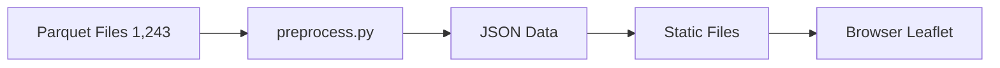

# Player Journey Visualization Tool - Architecture

This document outlines the architecture, technology choices, and design decisions for the Player Journey Visualization Tool built for LILA Games.

## Tech Stack
- **Data Pipeline**: Python 3.14 + pyarrow + pandas — preprocesses 1,243 parquet files into optimized JSON
- **Frontend**: Vanilla HTML/JS/CSS + Leaflet.js (CDN) + Leaflet.heat plugin (CDN)
- **Hosting**: Static site (Vercel/Netlify/GitHub Pages)
- *Note:* No build tools, no framework, no Node.js — chose simplicity and zero-dependency deployment.

## Why These Choices
- **Python for data pipeline:** parquet is a Python-ecosystem format, pyarrow reads it natively.
- **Leaflet.js:** purpose-built for spatial data, built-in zoom/pan/layers, `CRS.Simple` mode for non-geographic images, battle-tested heatmap plugin.
- **Static site:** data is small enough (~89K rows) to preprocess into JSON and serve as static files; no backend needed.
- **Vanilla JS:** no React/Vue overhead for a tool with 6 modules and straightforward DOM interactions.

## Data Flow


1. `preprocess.py` reads all parquet files across 5 date folders.
2. Decodes `event` column from bytes to strings.
3. Classifies users as human (UUID regex) vs bot (numeric ID).
4. Converts world coordinates `(x, z)` to minimap pixel coordinates using per-map config.
5. Outputs:
   - `matches.json` — index of 796 matches with metadata
   - `matches/{id}.json` — per-match detail with pixel-mapped coordinates
   - `heatmaps.json` — pre-aggregated coordinate arrays for kill/death/traffic/loot overlays
6. Browser loads match index, then lazy-loads per-match detail on selection.

## Coordinate Mapping (Key Technical Detail)

Each map has a `scale`, `origin_x`, and `origin_z`:
- **AmbroseValley**: scale=900, origin=(-370, -473)
- **GrandRift**: scale=581, origin=(-290, -290)
- **Lockdown**: scale=1000, origin=(-500, -500)

**Conversion formula:**
```javascript
u = (world_x - origin_x) / scale
v = (world_z - origin_z) / scale
pixel_x = u * 1024
pixel_y = (1 - v) * 1024   // Y-flip for image coordinates
```

In Leaflet with `CRS.Simple`, the 1024×1024 minimap is an image overlay with bounds `[[0,0], [1024,1024]]`. Points use `[pixel_y, pixel_x]` format (Leaflet's `[lat, lng]` convention).

**Verification:** 0 out-of-bounds coordinates across all 89,104 data points. Pixel ranges per map:
- **AmbroseValley**: x=[54-762], y=[78-910]
- **GrandRift**: x=[113-963], y=[213-855]
- **Lockdown**: x=[114-868], y=[175-804]

## Assumptions

| Area | Assumption | Rationale |
|------|-----------|----------|
| **Timestamps** | `ts` values represent match-internal time, not wall clock. | README: 'time elapsed within the match'. Values cluster around 1970 epoch + days, but differences within a match are what matter. |
| **Bot detection** | `user_id` matching UUID regex = human; otherwise = bot. | README: 'short numeric ID' vs UUID format. |
| **Date assignment** | Folder name determines the date. | Files organized by `February_10..14` folders. |
| **Heatmaps** | Aggregated across ALL matches per map. | More useful for level design than per-match heatmaps. |
| **Match reconstruction** | All files sharing same `match_id` belong to same match. | README confirms this. |
| **Event column** | Stored as bytes, decoded as UTF-8. | README: 'decode with `.decode(utf-8)`'. |

## Tradeoffs

| Decision | Alternative | Why I chose this |
|----------|------------|-------------------|
| **Static JSON vs Database** | PostgreSQL/SQLite backend | 89K rows is small; static JSON eliminates backend complexity and hosting costs. |
| **Pre-computed heatmaps vs On-demand** | Calculate heatmaps client-side | Pre-computation avoids loading all raw data on every page load. |
| **Leaflet vs Canvas/D3** | Raw HTML Canvas or D3.js | Leaflet provides zoom/pan/layer management out of the box; perfect fit for spatial overlays. |
| **Per-match lazy loading vs Bulk load** | Load all match data upfront | Keep initial load fast (~30KB index); load detail (~5-10KB) only when selected. |
| **Vanilla JS vs React** | React/Next.js | Only 6 modules with simple DOM updates; React adds bundle size and build step for no benefit. |
| **Python preprocessor vs JS build** | Node.js build pipeline | Python already installed, pyarrow is the standard parquet reader. |
